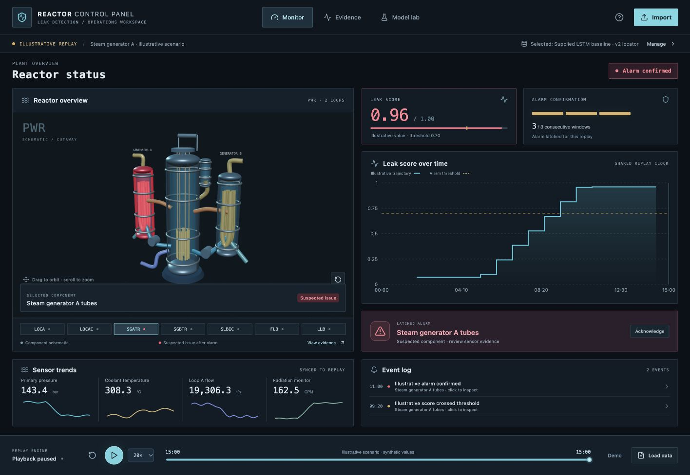

# Reactor Control Panel

A local control-room dashboard for the CNL hackathon leak-detection prototype. Explore a simplified 3D reactor, replay recorded sensor data, inspect model evidence, import updated trained models, and optionally continue training from existing weights.



The app follows `LeakDetectionV3.ipynb` (latest supplied reference): a binary LSTM leak detector, an LSTM locator (the original eight-class export or a seven-class leak-only export), a fitted StandardScaler, and the notebook's feature/window configuration. The supplied notebook and dataset provide the modeling foundation; this dashboard adds model packaging, interactive replay, visualization, version management, and a continued-training workflow.

**Status:** the interface includes a clearly labeled synthetic replay. The team's trained `.keras` files and matching preprocessing artifacts are stored locally after import, rather than bundled in Git. Import once with verified class order and sensor interval to run real inference; the selected version survives restarts. Test fixtures use tiny generated LSTMs only to verify the software; they are not trained leak-detection models and are not installed in the app.

## Quick start

**On this laptop, dependencies and the supplied LSTM baseline with the v2 locator are already installed.** From `dashboard/frontend`, run:

```sh
python ../run.py
```

From `dashboard`, run `python run.py` instead. The launcher locates the project using its own file path, uses the dashboard's Python environment, and starts both the frontend and backend. It finds Node in your shell or the installed Codex runtime, so a missing `pnpm` command in your terminal does not prevent startup. Keep the terminal open; Ctrl+C stops only services started by that launcher. If the dashboard services are already running, it prints their addresses and reuses them.

To check the installed paths without starting services, use `python ../run.py --check` from `frontend`. To install dependencies on a fresh checkout, use `python run.py --install` from `dashboard`; this uses an installed pnpm, the bundled Codex pnpm, or npx to run pnpm 11 without installing it globally.

### Manual setup and separate terminals

Use **Python 3.12**, **Node.js 22 LTS**, and **pnpm 11**. The backend was tested on Apple Silicon macOS with TensorFlow 2.20.0. scikit-learn is pinned to 1.6.1 to match the supplied StandardScaler export. A browser with WebGL is needed for the interactive reactor.

`frontend/pnpm-lock.yaml` locks the frontend packages. `backend/requirements-macos-py312.lock` records the complete tested Python environment; use it instead of `requirements.txt` to reproduce that macOS/Python 3.12 setup exactly. The shorter requirements file is the starting point on other supported platforms.

From the repository:

```sh
cd dashboard
python3.12 -m venv .venv
source .venv/bin/activate
python -m pip install -r backend/requirements.txt
cd frontend
pnpm install
cd ..
```

Start the model service in one terminal, from `dashboard`:

```sh
source .venv/bin/activate
python -m uvicorn backend.app:app --host 127.0.0.1 --port 8000
```

Start the interface in a second terminal:

```sh
cd dashboard/frontend
pnpm dev
```

Open **http://127.0.0.1:5173**. Start with the **Demo** button and press **Play**. At 20× speed, the 15-minute illustrative recording plays in 45 seconds. The server and files stay on this computer. Once dependencies are installed, the app needs no external fonts, 3D assets, or network services.

The sibling machine-learning folders remain separate. All dashboard source, local data and model storage live inside `dashboard/`.

## Pages and presentation flow

- **Monitor:** an orbitable cutaway reactor, score history, sensor trends, consecutive-window confirmation and event log. Play, pause, restart or seek the shared timeline. Clicking an event seeks to its timestamp. The desktop layout is designed to fit one screen; smaller screens scroll to preserve readability.
- **Evidence:** inspect the declared location outputs (seven leak-only classes or eight including “No leak”), detector/locator disagreement where applicable, observed sensor histories, and the model's input and alarm contract. Only observations reached by the cursor are displayed.
- **Model lab:** import a trained version, select it, export it, roll back to a previous version, or prepare a continued-training job. Every candidate remains separate from its baseline.

For a short demo: show the no-alarm period, play at 20×, observe three consecutive threshold hits, inspect the highlighted steam generator, acknowledge the alarm, then click its event to examine the evidence. The illustrative values demonstrate interface behavior and are explicitly labeled throughout.

The built-in 15-minute demonstration is authored in `frontend/src/types.ts`: sensor readings are generated using ramps and sine waves, leak scores are a prescribed rising trajectory, and the location ranking switches to steam generator A. It uses the same display and alarm mechanics but does not run either trained model, use plant recordings, or simulate reactor physics. Importing a trained model does not silently replace these demo scores.

## Import the team's trained models

In **Model lab → Update model**, choose these four matching notebook exports, or a ZIP containing them:

```text
lstm_leak_classifier.keras
lstm_leak_location.keras
scaler.pkl
config.pkl
```

Version suffixes such as `lstm_leak_location_v2.keras` are accepted and normalized to the locator role. Choose exactly one detector and one locator; original filenames are recorded in the manifest. The original notebook's `joblib.dump` exports are supported. Keep them **uncompressed**. The backend restricts pickle objects to the expected NumPy/StandardScaler structures and loads Keras models with safe mode. Custom layers, Lambda objects, legacy `.h5` files, arbitrary Python objects and unrelated model architectures are rejected. Use packages from your team; this local prototype is not a public upload service.

Give the version a descriptive name, enter the actual sensor sampling interval used by its training data, select the locator format, and enter and confirm its exact output order. The original eight-output order is:

```text
No leak, LOCA, LOCAC, SGATR, SGBTR, SLBIC, FLB, LLB
```

A seven-output locator can be imported by selecting **7 outputs · leak locations only (v2)** and entering the confirmed seven-class order. The form uses the currently selected model’s order as its initial value (otherwise the original eight-class order); verify this against training labels rather than assuming it from the filename. Any permutation of the supported seven classes (or eight including No leak) is accepted and explicitly mapped. Neither these Keras weights nor the supplied config contains the v2 class names or sampling interval.

`config.pkl` must contain:

```python
{
    "feature_cols": ["ordered", "sensor", "column", "names"],
    "time_steps": 12,
    "stride": 5,
}
```

The feature names above are placeholders, **not** an input schema. Use the actual notebook export. A standalone `.keras` file does not contain everything needed to interpret raw sensor data correctly; its matching scaler, feature order and class meanings matter.

The importer checks both models' input dimensions and output widths against the configuration. The detector must output one probability; the locator must output seven or eight probabilities matching the declared class order, summing to one. A seven-output locator always names a leak class, so the locator runs only after a confirmed detector alarm and votes on the recording’s first three clips. The issue area uses the most frequent clip argmax. If all three votes differ, the alphabetically first tied class wins, matching V3’s `Series.mode()[0]`. Results stay hidden until the alarm and all three clips are available; its location scores are conditional on a leak rather than evidence that one exists. The original notebook's Sequential LSTM/Dense/Dropout architecture is supported.

Validation stores the package as a new immutable version. **Select this model** explicitly to use it for future replays. Importing does not retrain it. Existing replays retain their original model results; re-import a recording to score it with a different version. Select an earlier version in Model lab to roll back.

Model versions, active selection, uploaded recordings, and training results persist in `models/` and `data/` across restarts. Exporting a version downloads a complete ZIP with a `manifest.json`, including the sampling interval, class order and alarm policy. These folders are ignored by Git. Back them up separately if needed. `models/index.json` preserves the selected version; opening the app or restarting the backend does not require another upload. The initial screen still opens the synthetic demo until a recorded CSV is loaded.

An optional package manifest can include confirmed units:

```json
{
  "classes": ["No leak", "LOCA", "LOCAC", "SGATR", "SGBTR", "SLBIC", "FLB", "LLB"],
  "sample_interval": 10,
  "threshold": 0.7,
  "persistence": 3,
  "signal_units": {"P": "bar", "TAVG": "°C"}
}
```

Those interval and unit values are examples: replace them with verified metadata for your actual dataset. A manifest's values take precedence over the import form defaults. Without declared units, real readings display “dataset units.” The synthetic scenario's units belong only to that scenario.

## Replay sensor CSVs

1. Import and select a model package.
2. Choose **Import → Replay data** and select the model to use.
3. Upload one UTF-8, comma-separated CSV with `TIME` and every configured sensor column.
4. Play the returned recording, adjust 1×/5×/20× speed or seek the timeline.

`TIME` is in seconds and must increase strictly at the package's sampling interval. All required readings must be numeric and finite. Duplicate headers, missing sensors, NaNs, duplicate/backward timestamps and mismatched intervals are rejected with an explanation. Additional columns are allowed and ignored. The scaler's original feature order is always used. Inputs are converted to float32 before scaling, as in V3, and model windows are float32. There is no automatic interpolation or refitting during replay.

Use **Download sensor headers** in Model lab to get a CSV header template for a loaded model. A recording needs at least one full window. Limits: 25 MB / 50,000 rows per CSV, 256 MB per model package. Operational sensor files matching the model are accepted; dose-only files lack the required features and are rejected.

The server may compute the recording's causal windows before playback; the frontend reveals each result only at its actual window-end timestamp. No future reading contributes to an earlier prediction. The latest assessment timestamp is shown because sensor sampling and model assessment cadence can differ.

## Fine-tune an existing model

**Model lab → Improve current model** continues training from the selected baseline's weights; it does not initialize a new model or refit the scaler. For a seven-class locator, only the first six clips of each recording with leak labels train its location network, matching V3’s `N_EARLY=6`; verified pre-onset clips are also excluded; the detector still trains on both leak and non-leak windows. Declared output order is preserved during training and evaluation.

1. Select the baseline and name the candidate.
2. Add labeled sensor CSVs. Each must satisfy the baseline schema and sampling interval.
3. Review each recording's label, scenario/group identifier, split (`train`, `validation`, `test`) and origin (`existing` or `new`). These are user-supplied labels, not predictions.
4. Include representative old data and new data in the training split. Each split needs at least one leak and one non-leak recording, so a minimal job has six independent recordings.
5. Keep related runs in the same group and split. The app rejects group crossings and identical sensor traces, including renamed or time-shifted copies. This check cannot prove that different traces are independent; use the dataset's actual run/scenario provenance.
6. Confirm that validation and test groups were never used to train the imported baseline. Do not recycle baseline training runs into evaluation.
7. If verified onset metadata exists, enter its `TIME` value in seconds. Before-onset windows are labeled No leak. Without verified onset, the whole file uses its scenario label and no detection-delay claim is made for it.
8. Start the job and watch actual epoch progress. The service trains a separate candidate in the background, uses a small learning rate (default 0.00001), clips gradients, and keeps the weights with the best combined validation loss. Training stops after three non-improving epochs or the chosen limit.
9. Review baseline and candidate on the **same untouched test recordings**. Select the candidate explicitly or keep the baseline. Export either version whenever needed.

Evaluation reports detected/missed leak runs, runs with false alarms, quiet non-leak runs, location accuracy across all labeled model windows for an eight-class locator or detected leak recordings using the first-three-clip vote for a seven-class locator, and median delay for detected runs with supplied onset metadata. A latched alarm before verified onset counts as a false alarm and a missed valid detection. Median delay excludes missed runs, so always read it together with misses and its detected-run count. This is a small user-defined evaluation, not a claim of general plant performance. Reusing the same test set repeatedly for model selection will bias conclusions; reserve new untouched groups for final reporting.

Only one training job runs at a time. A server restart marks interrupted jobs as failed and preserves the baseline. The job is not resumable after a process restart; start a new one. Uploaded model packages are required to enable real replay and training; the illustrative demo never pretends to run ML.

## What the 3D reactor means

The graphic is a simplified PWR schematic, inspired by the supplied cutaway references. It is not a verified geometric model of a specific plant or an engineering simulator. The visualization includes vessel, core, control rods, pressurizer, pumps, steam generators and connecting lines.

| Notebook class | Highlighted area |
| --- | --- |
| LOCA | Hot-leg pipes |
| LOCAC | Cold-leg pipes |
| SGATR | Steam generator A tubes |
| SGBTR | Steam generator B tubes |
| SLBIC | Steam lines |
| FLB | Feedwater lines |
| LLB | Letdown line |

The locator cannot distinguish individual pipe segments within classes like LOCA; the schematic highlights the corresponding represented circuit. The core, control rods and pressurizer can be explored but do not get invented issue predictions.

Red marks the model-suspected component after an alarm is confirmed. The alarm latches for the replay, even if later scores fall. **Acknowledge** records operator awareness in the current replay; it does not resolve or clear the alarm. Seeking before the alarm or restarting reconstructs the prior state. Eight-class location outputs can disagree with the detector; Evidence makes this visible. Seven-class location rankings assume a leak and do not themselves provide a No leak judgment. They are withheld until an alarm; Evidence shows the first three clip votes, timestamps and mean softmax scores. The voted location stays fixed for that recording.

This is a hackathon decision-support prototype for recorded data, not a live monitoring system or an operational safety instrument. Sensor behavior, model performance, and physical location accuracy still require validation against the team's actual artifacts and data.

## Architecture and model replacement

```text
React + TypeScript
  ├─ Three.js / React Three Fiber: selectable reactor geometry
  ├─ Recharts: synchronized score and sensor history
  └─ HTTP /api → FastAPI (Python)
                  ├─ Model version registry and package validation
                  ├─ Saved scaler → causal windows → Keras models
                  ├─ Alarm policy and recorded replay results
                  └─ Background continued training and evaluation
```

The frontend consumes a stable replay response: timestamped readings, detector scores, location distributions and alarm events. New weights with the same contract can be imported directly. A different architecture requires updating the backend loader/adapter; different sensors or issue categories may also require chart labels and 3D mappings. The frontend does not execute arbitrary uploaded Python.

Useful API routes:

| Method | Path | Purpose |
| --- | --- | --- |
| GET | `/api/health`, `/api/models` | Service status and persisted versions |
| POST | `/api/models/import` | Validate and store a package |
| POST | `/api/models/{id}/activate` | Select a version |
| GET | `/api/models/{id}/export` | Download a complete package |
| GET | `/api/models/{id}/template` | Download expected CSV headers |
| POST | `/api/recordings` | Validate and store a CSV |
| GET | `/api/recordings/{id}/replay?model_id=...` | Score a recording |
| POST | `/api/training` | Start a continued-training job |
| GET | `/api/training/{id}` | Inspect actual job progress/results |

Interactive API documentation: http://127.0.0.1:8000/docs. Bind locally as shown; authentication, multi-user isolation and public deployment are out of scope. Set `REACTOR_STORAGE_DIR` to a separate writable folder if model/data storage should live elsewhere.

## Checks and troubleshooting

```sh
# From dashboard, with the Python environment active:
python -m pytest backend/tests -q

# From dashboard/frontend:
pnpm build
```

Tests cover causal prefix consistency, actual window timestamps, consecutive/latched alarms, invalid schemas, restricted pickle handling, incomplete packages, model import/selection/export/reload, split isolation, real small-model fine-tuning, and baseline preservation.

- **Cannot reach model service:** start FastAPI on port 8000; Vite forwards `/api` there. Use port 5173 for the frontend.
- **`pnpm: command not found`:** use `python ../run.py` from `dashboard/frontend` on this laptop. The launcher finds the installed runtime without modifying your shell settings. Use `--install` if frontend dependencies are missing. Manual pnpm commands require Node/pnpm to be installed and on your terminal's PATH.
- **`No module named 'backend'`:** the manual backend command must run from `dashboard`, the folder containing `backend/`. From `frontend`, first run `cd ..`, or use the launcher, which sets the directory automatically.
- **Missing/incompatible files:** export all four files together from the same notebook run. A scaler or configuration from another run can change model behavior even when dimensions happen to match.
- **Unsupported pickle objects:** re-export the standard notebook dictionary and StandardScaler using uncompressed `joblib.dump`. Do not change the loader to unrestricted pickle.
- **Keras version mismatch:** match the team's training runtime when needed. The loader intentionally rejects unsupported custom architecture. Preserve an environment snapshot alongside each trained package.
- **3D unavailable:** enable browser hardware acceleration/WebGL. Model evidence and component names remain accessible. No external 3D asset download is required.
- **No score at replay start:** wait until one complete window is available. For 12 readings sampled every 10 seconds from TIME=0, the first assessment is at TIME=110, not TIME=120.
- **A new model did not change an open chart:** existing replay results are pinned to their model version. Import the recording again with the new version.
- **Training data rejected:** check reviewed labels, separate groups, both leak/non-leak classes in every split, a mix of old/new training data, and truly independent evaluation runs.

For the upcoming team handoff, provide the four matching exports, one operational sensor CSV, confirmed sampling interval/units, class order, and—when evaluating delay—verified onset and group metadata. These files connect through the UI without a frontend rebuild.

### Supplied v2 baseline contract

The user confirmed the locator order `LOCA, LOCAC, SGATR, SGBTR, SLBIC, FLB, LLB`, 81 ordered features, a 10-second sensor interval, 12-reading clips, stride 5, and detector alarm at ≥0.7 for three consecutive clips. The locator uses the recording's first three clips after detection; it does not use the first three clips *after* the alarm. A 12-reading clip contains 120 seconds worth of samples but spans 110 seconds between the first and last timestamps, so the first assessment for a CSV starting at TIME=0 ends at TIME=110. Subsequent assessments are 50 seconds apart.

This policy may localize poorly if the recording begins with a long pre-leak period: the voting clips may precede onset. It follows the supplied workflow; evaluate it against verified onset data before making localization-performance claims. Future exported weights should include the matching config/scaler and `model_info.json` or an equivalent confirmed metadata manifest. A filename does not prove which training run produced the weights.

### V3 source and compatibility review

The supplied notebook is preserved unchanged at `docs/reference/LeakDetectionV3.ipynb`. See `docs/v3-compatibility.md` for the verified contract, differences in evaluation, and notebook execution issues. The user confirmed that the four installed model files are current for V3. They remain the selected baseline; no retraining or replacement upload is needed for this update. For future training runs, export and import matching weights, scaler and config together. The dashboard’s synthetic demonstration remains separate from actual model inference.
